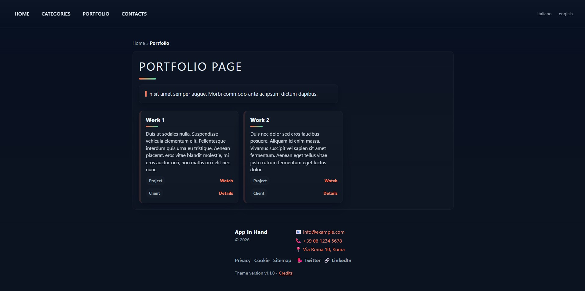

# Kickstart-WebKit

A minimalist, file-based PHP boilerplate for building fast, themeable websites. No bloat. Just fast, just light.

---

### 💡 Philosophy

Kickstart-WebKit was born from the need to develop simple websites quickly, without the overhead of large frameworks, complex build processes, or databases. The core principles are:

*   **No Backend Bloat:** No databases, no admin panels, no heavy dependencies. This is for content that is edited directly in the code.
*   **Zero Plugins:** The project is intentionally lean to ensure the fastest possible page load times and a minimal footprint.
*   **Direct Control:** You are in full control. What you edit in the PHP/HTML/CSS files is what you see in the browser. No compilation, no magic.

---

### ✨ Features

*   **Clean, File-Based Routing:** Create SEO-friendly URLs like `/products/my-product` without complex `.htaccess` rules.
*   **Config-Driven Theming:** Easily switch the entire look and feel of your site (CSS, images, etc.) by changing a single line in the config file. Perfect for creating multiple brand variations or dark/light modes.
*   **Zero Dependencies & No Build Step:** Pure PHP and HTML. No `composer install`, no `npm build`. Just edit the files and see the changes instantly.

---

### 🎯 Who is this for?

This boilerplate is designed for **web developers with some experience** who are comfortable working directly with PHP, HTML, CSS, JS, XML. It is the perfect starting point if you want a no-nonsense foundation for a landing page, a portfolio, or a small business website, and you value speed and simplicity above all else.

---

### 🚀 Getting Started

1.  Clone or download this repository.
2.  **Crucial:** Open the `assets/config/config.php` file and edit the configuration variables to match your local development environment.
3.  Start building your pages!

---

### 📦 Deploying to Production

Before deploying your site to a live server, it is **essential** to read and follow the instructions detailed in the `docs/migrate-to-production.txt` file to ensure security and proper functionality.

---

### 🛣️ Roadmap

This is a personal project that I use to speed up my own work. While it is provided "as-is", I have plans to improve it over time. The next major planned feature is:

*   **Caching routing maps:** Reduce repeated parsing of page-routing.xml by serializing the generated routingMap and routingInverse to a fast cache file (preferably a PHP file that returns the arrays so it benefits from OPcache). In production load the cached file when up to date; in development allow disabling or forcing regeneration.

---

### License

This project is licensed under the MIT License - see the [LICENSE](LICENSE) file for details.